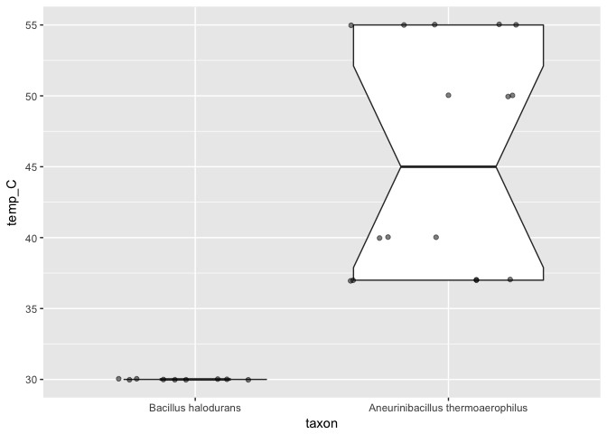

<!-- Please edit this file -- README.Rmd -- and then `knit()` the README.md. -->

[](http://www.repostatus.org/#wip)

# BacDiveR

This R package provides a programmatic interface for the [Bacterial
Diversity Metadatabase](https://bacdive.dsmz.de/) (Söhngen et al. 2014;
Söhngen et al. 2016) of the [DSMZ (German Collection of Microorganisms
and Cell Cultures)](https://www.dsmz.de/about-us.html). It helps you
download full datasets or just their IDs based on reproducible searches
against the BacDive Web Service.

## Installation

1.  Because the [BacDive API requires
    registration](https://bacdive.dsmz.de/api/bacdive/registration/register/)
    please do that first and wait for your access to be granted.

2.  Once you have your login credentials, install BacDiveR from GitHub
    with:

<!-- end list -->

``` r
# install.packages("devtools")
devtools::install_github("katrinleinweber/BacDiveR")
```

3.  After installing, run the following commands to save your login
    credentials locally:

<!-- end list -->

``` r
file.edit(BacDiveR:::get_Renviron_path())
```

4.  In that file, add your email and password directly after the `=`
    signs, save it, then restart R(Studio) or run:

<!-- end list -->

``` r
readRenviron(BacDiveR:::get_Renviron_path())
```

In the following examples, the data retrieval will only work if your
login credentials are correct in themselves (no typos) and were
correctly saved. Console output like `"{\"detail\": \"Invalid
username/password\"}"`, or `Error: $ operator is invalid for atomic
vectors` mean that either the login credentials or the `.Renviron` file
are incorrect. Please repeat steps 2 to 4.

## Example

The BacDive website lets you easily search for all their strains within
a given taxonomic unit. For example, [searching for
“Bacillus”](https://bacdive.dsmz.de/index.php?search=Bacillus)
returns a paginated list of strains that you can then access, download
and analyse further. All manual, though. BacDiveR automates this
workflow:

``` r
library(BacDiveR)
taxon_1 <- "Bacillus halodurans"
Bac_IDs <- retrieve_data(searchTerm = taxon_1) 
head(Bac_IDs) 
#> [1] 1112 1113 1114 1115 1116 1117
```

Calling `retrieve_data()` with just a `searchTerm` results in a vector
of numeric BacDive IDs. You can use such ID downloads for meta-analyses
of different bacterial taxons such as comparisons of taxon sizes, as
they are represented in the DSMZ’s collection.

### Downloading datasets

In order to analyse the actual datasets, we now need to download them.
Suppose  
we want to compare the optimal growth temperatures of strains from the
taxon *Bacillus halodurans* with another one. You can obtain that data
of course by feeding the ID vector obtained above into self-made loops
that calls `retrieve_data(…, searchType = "bacdive_id")`.

However, you can save yourself some time and effort by activating the
parameter `force_taxon_download`. This will get you all taxon data in a
single (albeit large) list of dataframes. Feel free to take a break
while the computers do some work for you:

``` r
taxon_2 <- "Aneurinibacillus thermoaerophilus"
Bac_data <- retrieve_data(taxon_1, force_taxon_download = TRUE)
#> Data download in progress for BacDive-IDs: 1112 1113 1114 1115 1116 1117
#> 1118 1119 23692 23693 23694 23695 23696 23697 23698 23699 23700 23701
At_data <- retrieve_data(taxon_2, force_taxon_download = TRUE)
#> Data download in progress for BacDive-IDs: 11385 11386 11387 11388 11389
#> 11390 11391 11392 11393 11394 11395 11396 11397 11398 11399
```

## Extracting data fields

We wanted the growth temperatures, right? As with any other database
field, you now need to determine its path within the list data structure
that BacDiveR returned to you. Use either

1)  RStudio’s `Environment > Data` viever, or
2)  `str(Bac_data)`, or
3)  your web browser’s JSON viewer on the dataset’s URL:
    [BacDive.DSMZ.de/api/bacdive/taxon/Bacillus/halodurans](https://bacdive.dsmz.de/api/bacdive/taxon/Bacillus/halodurans),

to find the `$`-marked path to the field of your interest. In our
example, it’s `$culture_growth_condition$culture_temp$temp`, which we’ll
now use to extract that field from all entries in our downloaded
datasets.

Multiple steps are necessary here, which could easily result in hardly
readable code if we used the regular assignment operator `<-`,
intermediate variables and nested function calls. We will [avoid this
with the pipe operator
`%>%`](https://cran.r-project.org/package=magrittr). It indicates that

1)  an object is passed into a function as its first argument, and that
2)  the function’s output is “piped” into the next function.

Note the `~ .x` prepended to the path
`$culture_growth_condition$culture_temp$temp`\! This is `map()`’s way of
indicating that each element in the piped-in `dataset` will be accessed
at that path.

``` r
library(magrittr) 
 
extract_temps <- function(dataset, taxon_name) {
  dataset %>%
  purrr::map(~.x$culture_growth_condition$culture_temp$temp) %>%
  unlist() %>%
  as.numeric() %>%
  data.frame(temp_C = ., taxon = rep(taxon_name, length(.))) %>%
  return()
}

temperature_Bac <- extract_temps(Bac_data, taxon_1) 
temperature_At <- extract_temps(At_data, taxon_2) 
```

Before visualising the data, we need to create a dataframe of the two
datasets.

``` r
library("ggplot2")

rbind(temperature_Bac, temperature_At) %>% 
  ggplot(aes(x = taxon, y = temp_C)) +
  geom_boxplot(notch = TRUE, varwidth = TRUE) +
  geom_jitter(height = 0.25, alpha = 0.5) +
  scale_x_discrete(position = "top", label_value("")) +  # or: xlab(label = NULL)
  ggtitle("Optimal growth temperatures of DSMZ-stored strains within the taxons:")
```

<!-- -->

And thus we find, that *Aneurinibacillus thermoaerophilus* contains
strains with different growth optima (note the groups of data *points*),
even up to the 50-something-°C-range as the `thermo`-part in its name
suggest). On the other hand, all *Bacillus halodurans* strains known to
BacDive were found to grow best at the lower temperature of NA°C. Thanks
to the notch in *Aneurinibacillus thermoaerophilus*’s box, we can also
say that there is a significant difference between the temperature
ranges of these two taxons, even before digging into the numbers:

``` r
summary(temperature_At$temp_C)
#>    Min. 1st Qu.  Median    Mean 3rd Qu.    Max. 
#>   37.00   37.00   45.00   45.62   55.00   55.00
```

## Summary

BacDiveR helps you download BacDive data for investigating it offline.
Use `?retrieve_data` to learn more about its options.

# References

<div id="refs" class="references">

<div id="ref-BD14">

Söhngen, Carola, Boyke Bunk, Adam Podstawka, Dorothea Gleim, and Jörg
Overmann. 2014. “BacDive—the Bacterial Diversity Metadatabase.” *Nucleic
Acids Research* 42 (D1): D592–D599.
doi:[10.1093/nar/gkt1058](https://doi.org/10.1093/nar/gkt1058).

</div>

<div id="ref-BD16">

Söhngen, Carola, Adam Podstawka, Boyke Bunk, Dorothea Gleim, Anna
Vetcininova, Lorenz Christian Reimer, Christian Ebeling, Cezar
Pendarovski, and Jörg Overmann. 2016. “BacDive – the Bacterial Diversity
Metadatabase in 2016.” *Nucleic Acids Research* 44 (D1): D581–D585.
doi:[10.1093/nar/gkv983](https://doi.org/10.1093/nar/gkv983).

</div>

</div>
